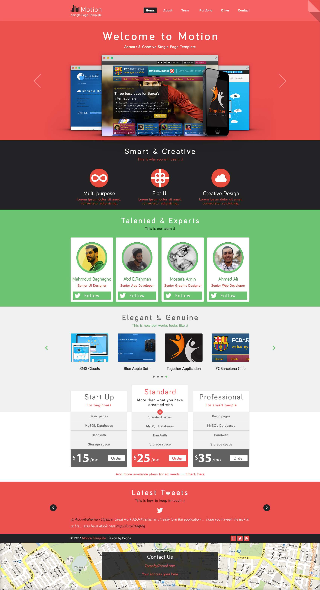

# Проект «Motion»

* Вёрстка: [Виталий Дубинка (Pixel-Man)](https://github.com/Pixel-Man).
* С реализованным проектом можно ознакомится по [ссылке](https://pixel-man.github.io/Motion/).

## Описание
Проект «Motion» был выполнен в рамках пройденного курса по Bootstrap 4.

* Используемые технологии: _HTML, CSS, БЭМ, JS, Адаптивный дизайн_.
* Фреймворки: _Bootstrap 4_.
* Препроцессоры: _SCSS_.
* Автоматизация: _Gulp_.

